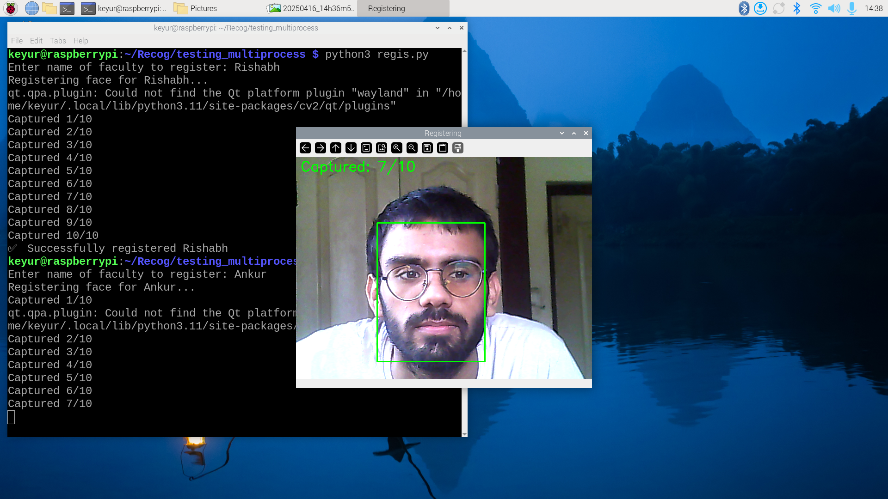
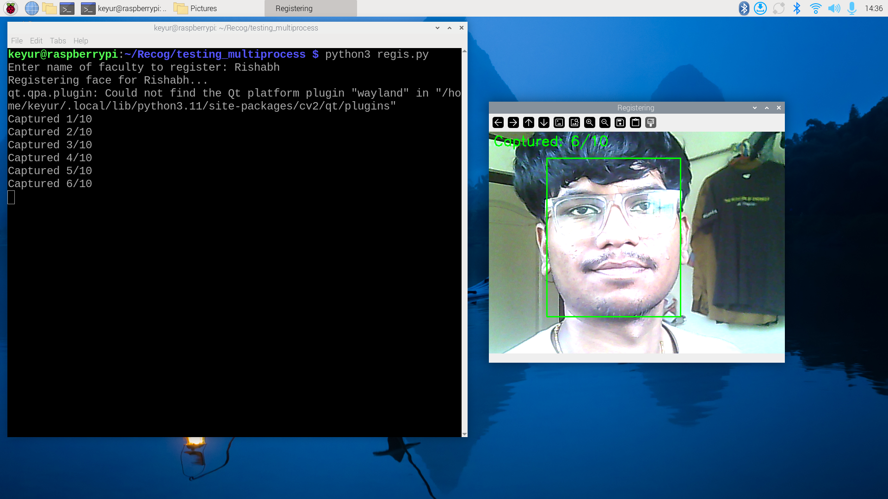
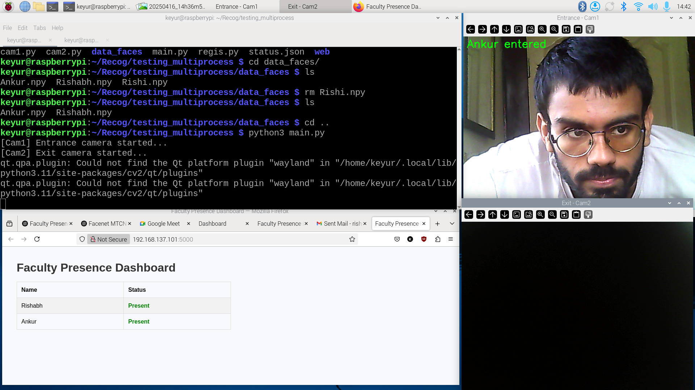
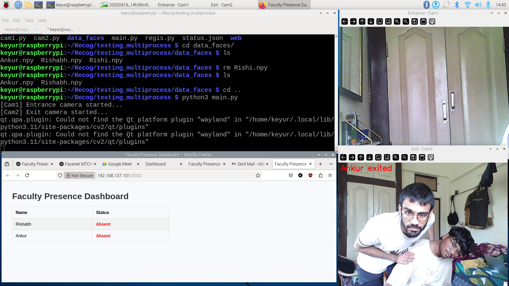
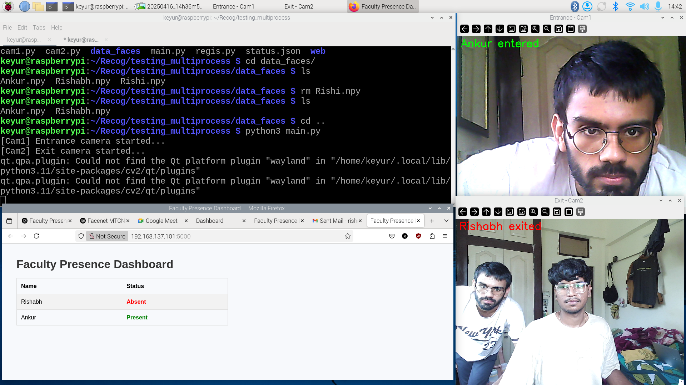

# Presence Detection System for Faculty using Raspberry Pi

This project implements a real-time presence detection system for faculty members using facial recognition. It utilizes a Raspberry Pi, camera modules, and deep learning models (MTCNN and InceptionResnetV1) to detect, recognize, and record faculty presence at departmental entry and exit points. A web dashboard provides a live view of faculty status.

---

## 🔧 Features

- Register new faculty members using face embeddings
- Real-time face recognition via dual cameras (Entry and Exit)
- Live web dashboard with status.json-based updates
- Subprocess-based camera handling for smooth performance
- Modular, scalable architecture

---

## 📦 Installation

Clone the repository:

```bash
git clone https://github.com/ankur-jat0009/Presence-Detection-System-for-Faculty-using-Raspberry-Pi.git
cd Presence-Detection-System-for-Faculty-using-Raspberry-Pi
```

Install dependencies:

```bash
pip install -r requirements.txt
```

Create required directories:

```bash
mkdir data_faces
```

## 🛠️ Run the Application

To run the application, follow these steps in order:

### 1. Register Faculty Faces
Run the **registration script** (`regis.py`) to register faculty faces first. This will capture and store facial embeddings.

```bash
python3 regis.py
```

- Follow the prompts in the terminal to register each faculty member. The system will ask for their name and collect samples for face embeddings.
- The data is stored in the `data_faces/` directory.

### 2. Start the Web Dashboard
In a separate terminal window, navigate to the `web` directory and run the **Flask web app** (`app.py`) to start the dashboard.

```bash
cd web
python3 app.py
```

- The dashboard will be hosted on the Raspberry Pi's IP at port `5000`.
  

### 3. Run the Main Application for Detection
Once the registration is done and the web dashboard is running, run the **main detection script** (`main.py`). This script will start the subprocesses for entry and exit detection (via `Cam1.py` and `Cam2.py`).

```bash
python3 main.py
```

- The **entry camera (cam1.py)** will detect faculty members at the department's entrance.
- The **exit camera (cam2.py)** will detect faculty members leaving.

The system will continuously update the `status.json` file, and the web dashboard will reflect real-time presence/absence status.

---

## Access the Web Dashboard

Once everything is running, open a browser and navigate to:

```text
http://<your-pi-ip>:5000
```

Here, you will see the real-time presence status of faculty members. You can monitor the updates as the faculty members enter or exit based on the camera feeds.


---

## Web Dashboard

- Displays real-time presence status
- Uses Recog/app/status.json to reflect changes
- Built with Flask and Jinja templates

---

## Model & Libraries Used

- facenet-pytorch: For face detection (MTCNN) and embedding (InceptionResnetV1)
- OpenCV: For real-time camera feed processing
- PIL, NumPy: For image and data handling
- Flask: To host the web dashboard

---

## 🛠️ Usage

- main.py launches the UI for registration and detection
- Cam1.py and Cam2.py run entry and exit detection simultaneously as subprocesses
- status.json logs all updates and powers the dashboard

---

## 📸 Screenshots

## Registration Screenshot





## Entry Detection Screenshot



## Exit Detection Screenshot




---

## ⚠️ Limitations

- Camera accuracy affected by lighting conditions and distance
- Raspberry Pi may face performance bottlenecks with multiple recognitions
- No anti-spoofing detection (assumes live feed is genuine)

---

## 🔮 Future Work

- Switch to lightweight models like MobileFaceNet or MediaPipe for better performance on Raspberry Pi
- Store attendance logs and embeddings on cloud services
- Add authentication and admin access for dashboard security
- Extend functionality for student attendance or cross-department use

---

## 🤝 Contributing

Pull requests are welcome!
